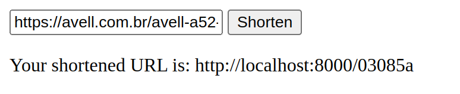

# url-shortener
This project is made to test some FastAPI features, python projects structure and experiment system design ideas

## Upcoming implementations
- [ ] Caching with Redis
- [ ] Rate Limiting
- [ ] Improve CSS
- [ ] Observability & metrics
- [ ] Github Actions
- [ ] Deploy on a cloud provider with custom domain

## Installation

### Setup database
```shell
$ docker-compose up
``` 

### Install requirements
```shell
$ pip install -r requirements.txt
```

## Run app
```
$ uvicorn main:app --reload
```

## Usage

On your browser, go to `http://localhost:8000`

It should appear like this:  


Paste your URL and click "Shorten", then the new URL should appear:

